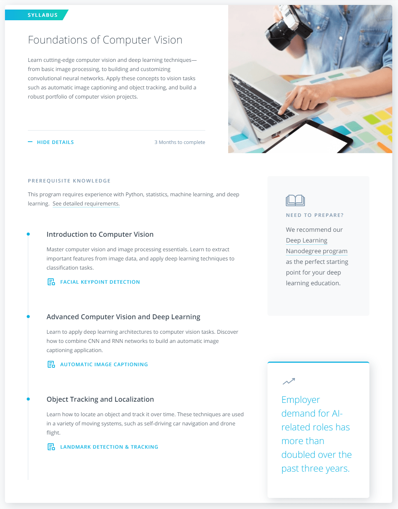

# [Udacity Computer Vision Nanodegree](https://www.udacity.com/course/computer-vision-nanodegree--nd891) 

#### Become a Computer Vision Expert

Master the computer vision skills behind advances in robotics and automation. Write programs to analyze images, implement feature extraction, and recognize objects using deep learning models.

## [Syllabus pdf](https://d20vrrgs8k4bvw.cloudfront.net/documents/en-US/Computer+Vision+Nanodegree+Syllabus.pdf)
